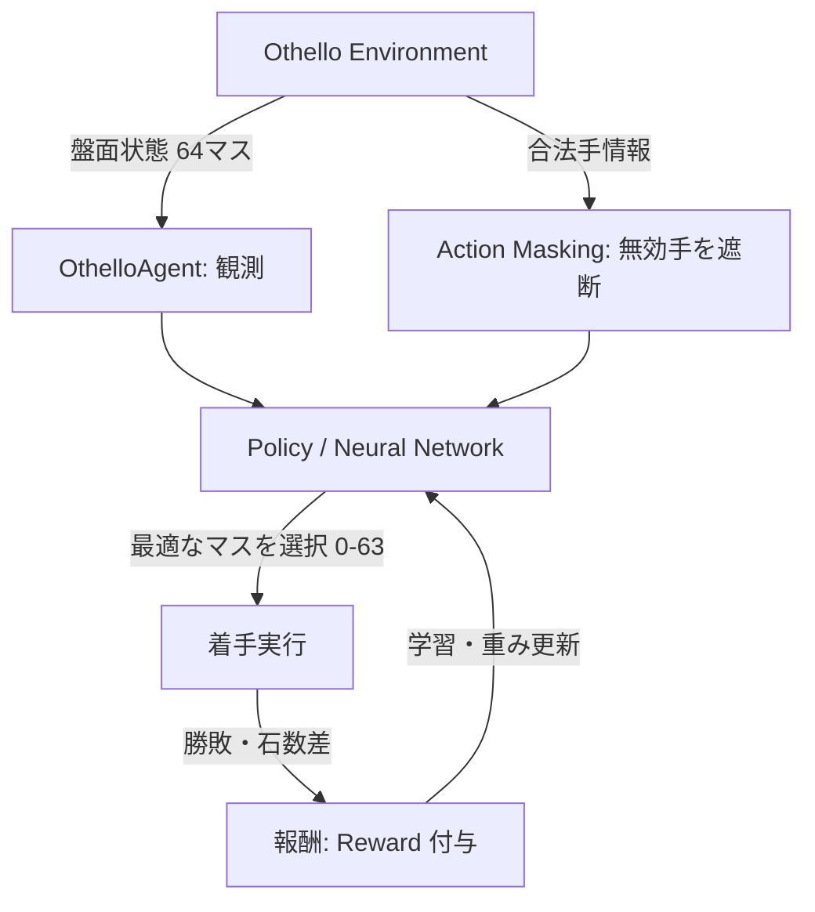

# 2D Othello (Reversi) with Unity ML-Agents 🎮🤖

Unity (2D) と **ML-Agents (強化学習)** を組み合わせたオセロ（リバーシ）プロジェクトです。  
AIはルールベースではなく、**自己対戦（Self-play）強化学習** を通じて自律的にオセロの戦術（角の重要性、確定石の確保、相手の着手可能マスの制限など）を学習・進化させます。

---

## 📋 目次
1. [プロジェクトにおける ML-Agents の役割・仕組み](#1-プロジェクトにおける-ml-agents-の役割仕組み)
2. [ゲームの実行・対戦方法](#2-ゲームの実行対戦方法)
3. [ML-Agents による自己対戦学習の手順](#3-ml-agents-による自己対戦学習の手順)
4. [学習記録・進捗の確認方法 (TensorBoard)](#4-学習記録進捗の確認方法-tensorboard)
5. [学習済みモデル (.onnx) の組み込み方法](#5-学習済みモデル-onnx-の組み込み方法)
6. [トラブルシューティング](#6-トラブルシューティング)

---

## 1. プロジェクトにおける ML-Agents の役割・仕組み

本プロジェクトでは、対戦相手の思考ルーチンを固定プログラムではなく **ニューラルネットワーク（PPO: Proximal Policy Optimization）** によって実現しています。



### 🧠 強化学習の設計詳細

- **Observation（観測空間）: 64次元**
  - 8×8 の全マスを **「現在の手番プレイヤー視点」** に正規化して観測します。
    - 自分の石: `+1.0`
    - 相手の石: `-1.0`
    - 空マス: `0.0`
  - これにより、黒番・白番で別々のモデルを用意する必要がなく、1つの共通モデルでオセロの打ち方を完結させることができます。

- **Action（行動空間）: Discrete (64)**
  - 盤面の 0 〜 63 のマス番号から 1 つを選択して着手します。

- **Action Masking（無効手マスク）の採用**:
  - オセロのルール上「石を置けないマス」を `WriteDiscreteActionMask` で完全にマスク（選択肢から除外）します。
  - AIが無駄な反則手を試行錯誤する時間をゼロにし、**常に合法手の中から最適手を選択**させることで学習効率を劇的に高めています。

- **Reward（報酬設計）**:
  - **勝利**: `+1.0`
  - **敗北**: `-1.0`
  - **引き分け**: `0.0`
  - **石数差シェイピング**: 終局時の獲得石数差に応じて微小なボーナス（最大 `±0.1`）を加算し、より大差で勝つ手を促します。

- **自己対戦（Self-play）システム**:
  - 1つのオセロ盤に対して、手番が回ってきたプレイヤーとして同じAIが交互に着手します。
  - 人間の模範データなしで、AI同士が何百万局も対戦を繰り返すことで、自然と強力な定石を発見していきます。

---

## 2. ゲームの実行・対戦方法

### (1) Unity エディタでシーンを構築
1. Unity エディタで本プロジェクト（`Othello`）を開きます。
2. 上部メニューバーの **`Othello` -> `1. Setup Playable Game Scene`** をクリックします。
   - 盤面、UI（スコア・手番・メッセージ）、操作ボタン、AIが自動で配置されます。

### (2) ゲームのプレイ
Unity の **Play（再生）ボタン** を押すと対局が始まります。

- **操作方法**:
  - 盤面上の **黄色い丸（合法手ハイライト）** が出ているマスをクリックして石を置きます。
- **画面下部のボタン機能**:
  - **`人 vs AI`**: あなた（黒番・先手）と AI（白番・後手）の対戦（デフォルト）。
  - **`人 vs 人`**: 1台のPCで2人のプレイヤーが交互に打つモード。
  - **`AI vs AI (観戦)`**: AI同士の対戦を自動で進め、観戦するモード。
  - **`🔄 リスタート`**: 盤面を初期状態に戻して新規対戦を開始。

---

## 3. ML-Agents による自己対戦学習の手順

### (1) 前提条件（Python 仮想環境）
Python 3.9 〜 3.10 の仮想環境にて、必要なパッケージをインストールします：

```bash
# 仮想環境の有効化 (PowerShellの場合)
.\env\Scripts\Activate.ps1

# 依存パッケージのインストール
pip install "setuptools<70" onnx onnxscript
pip install mlagents
```

### (2) Unity で並列学習用シーンを作成
1. Unity で新規シーン（`Ctrl + N`）を開きます。
2. 上部メニューの **`Othello` -> `2. Setup ML-Agents Training Scene (16 Boards)`** をクリックします。
   - 16面のオセロ盤が配置され、**16局が同時に超高速で並列学習**できるようになります。

### (3) 学習コマンドの実行
ターミナルで以下のコマンドを実行します：

```bash
mlagents-learn ML-Agents/config/othello_selfplay.yaml --run-id=Othello_Train_01 --force
```

コンソールに以下が表示されたら、Unity の **Play（再生）ボタン** を押します：
```
[INFO] Listening on port 5004. Start training by pressing the Play button in the Unity Editor.
```
再生すると、16面でAI同士が一斉に対戦を始め、ターミナルに進捗ログが表示されます。

---

## 4. 学習記録・進捗の確認方法 (TensorBoard)

学習の進み具合（AIの強さや累積報酬）は **TensorBoard** でリアルタイムに可視化できます。

学習を実行したまま、**別のターミナル** を開いて以下を実行します：

```bash
tensorboard --logdir results
```

ブラウザで `http://localhost:6006` を開くと以下のグラフが確認できます：

| グラフ項目 | 内容・見方 |
| :--- | :--- |
| **`Environment/Cumulative Reward`** | 1エピソードあたりに獲得した平均報酬。 |
| **`Environment/Episode Length`** | 1対局にかかった手数（オセロでは通常50〜60手前後）。 |
| **`Losses/Policy Loss`** | 方策関数の学習ロス（安定して収束しているか確認）。 |
| **`Losses/Value Loss`** | 盤面の形勢判断（価値関数）の予測誤差。 |

---

## 5. 学習済みモデル (.onnx) の組み込み方法

学習が完了（または `Ctrl + C` で途中で停止）すると、以下のパスに学習済みモデルファイルが生成されます：
`results/Othello_Train_01/Othello/Othello.onnx`

### Unity への適用手順：
1. 生成された **`Othello.onnx`** を Unity の Project ウィンドウ（例: `Assets/Models/`）にドラッグ＆ドロップします。
2. 対戦シーン（Playable Game Scene）を開きます。
3. `AI_Agents` の下にある **`Agent_White`**（または `Agent_Black`）を選択します。
4. Inspector の **`Behavior Parameters` -> `Model`** の欄に、ドラッグした `Othello.onnx` を割り当てます。
5. **`Behavior Type`** を **`Inference Only`**（推論専用）に設定します。
6. シーンを再生すると、**あなたが学習させた強豪AIと実際に対戦できます！**

---

## 6. トラブルシューティング

### Q. `ModuleNotFoundError: No module named 'onnxscript'` が出る
- PyTorch 2.x の ONNX エクスポート用パッケージが不足しています。以下を実行してください：
  ```bash
  pip install onnx onnxscript
  ```

### Q. `ModuleNotFoundError: No module named 'pkg_resources'` が出る
- `setuptools` のバージョンによるものです。以下を実行して解決します：
  ```bash
  pip install "setuptools<70"
  ```

### Q. プロセスが固まって止まらない・強制終了したい
- PowerShell で以下を実行すると、残留している Python / ML-Agents プロセスを一括終了できます：
  ```powershell
  Stop-Process -Name python, mlagents-learn -Force -ErrorAction SilentlyContinue
  ```
